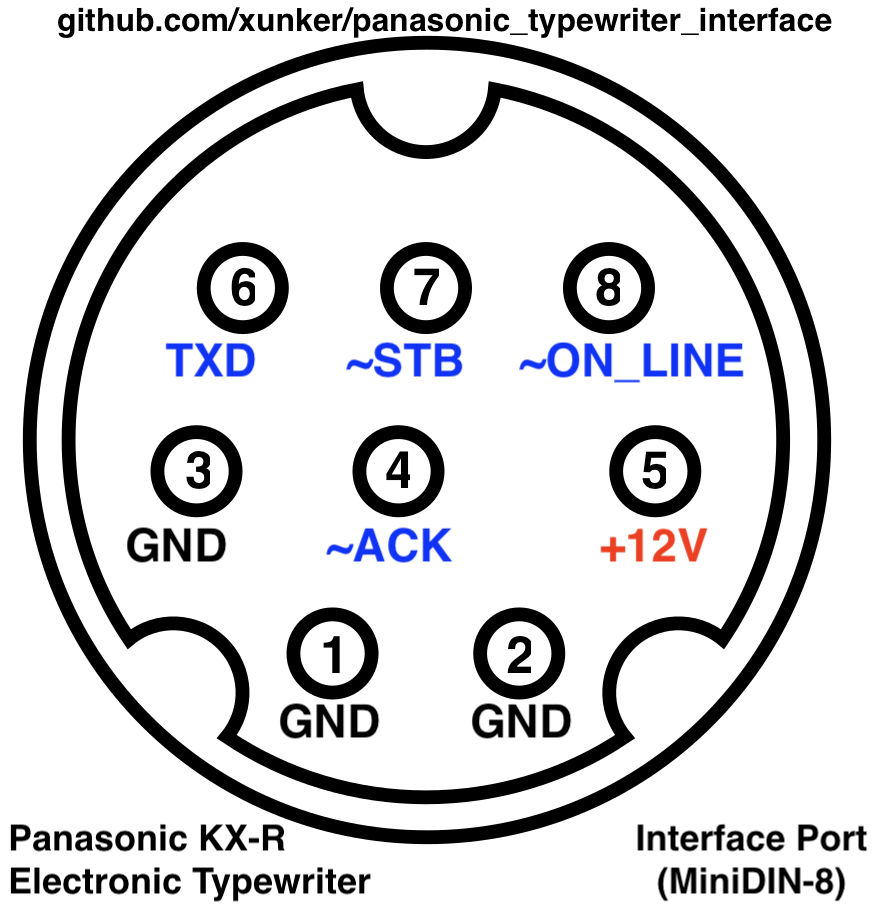

# Panasonic Typewriter MiniDIN-8 and DE-9 Pinout

https://github.com/xunker/panasonic_typewriter_interface

# Pinout

## MiniDIN-8

DIN Pin | X-Over Pin | Signal   | Source  | Direction | Notes
--------|------------|----------|---------|-----------|---------------------
1       |          2 | gnd      |         |           |
2       |          1 | gnd      |         |           |
3       |          5 | gnd      |         |           |
4       |          4 | ~ACK     | IC1 P16 | out       | (4)
5       |          3 | +12V     |         |           | For accessory power?
6       |          8 | TXD      | IC1 P24 | in        | (1,2,3)
7       |          7 | ~STB     | IC1 P18 | in        | (1,2,3)
8       |          6 | ~ON_LINE | IC1 P23 | in        | (1,2,3)
Shield  |     Shield | gnd      |         |           |

### Notes

* `DIN Pin` column is the pin numbering if you are using a "straight-through"
  cable that does not swap any pins. These would be the kind of cables used to
  connect a Macintosh computer to a Modem.
* `X-Over Pin` column is the pin number if you are using a Macintosh-style
  printer cable which swaps pins 1-2, 3-5, and 6-8. These are also called
  "null-modem" or "cross-over" cables.
* `Direction` is relative to the Typewriter itself.
* `Source` is where the pin connects to inside my own R435 typewriter. This
  will vary depending on model.

1. Routed to typewriter CPU pin through a 100-ohm resistor
2. 1.5K pull-up to +5v
3. Decoupled to ground via a 103Z ceramic cap (10K pF, +80%/-20% tolerance)
4. 10K pull-down to ground

#### IMPORTANT - LOTS OF DANGER!

Pin 5 may carry **12V**! That voltage can COMPLETELY RUIN your microcontroller!
DO NOT CONNECT THIS PIN DIRECTLY TO YOUR DEVICE! Verify the voltages of ALL PINS
before connecting typewriter to your device.

## DE-9 / DB-9

I based my work from [this page](./panasonic_rp-k100_interface_circuit.pdf) out
of the KX-W50TH/KX-W60TH service manual, so this should also work with
appropriate DE-9 (DB-9) connector. It is, however, **untested**.

DE-9 Pin | Signal   | Direction | Notes
---------|----------|-----------|------
1        | ~ON_LINE | in        |
2        | ~STB     | in        |
3        | ~ACK     | out       |
4        | ~TXD     | in        |
5        | n/c      |           |
6        | n/c      |           |
7        | n/c      |           |
8        | n/c      |           |
9        | gnd      |           |

### Notes

* `Direction` is relative to the Typewriter itself.