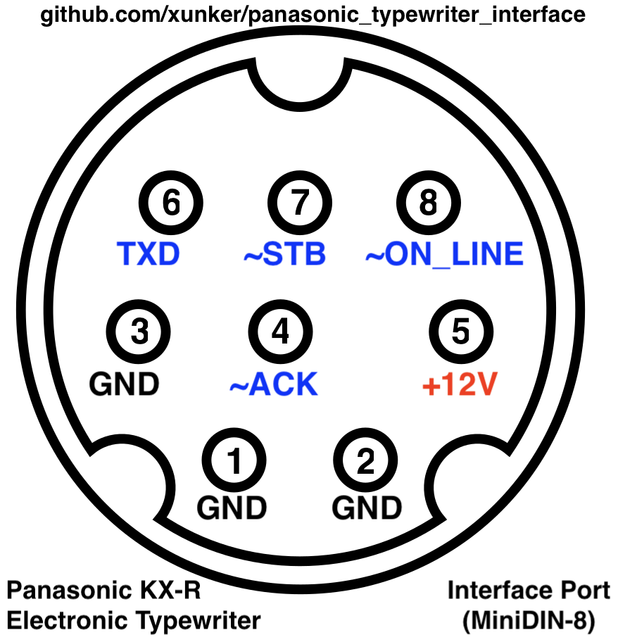

# Panasonic Typewriter Interface

https://github.com/xunker/panasonic_typewriter_interface

Print text using the Interface Port of your compatible Panasonic KX-R/KX-W
Daisywheel or Thermal typewriter, or KX-WD55 printererer. Emulates the
serial/RS-232 function of the KX-R60, RP-K100, or RP-K105 interface adapters.

Use your 🏋️heavy🥌 and 🐢slow🐌 typewriter as a noisy, inconvenient, inflexible,
single-page printer!

## Compatibility

### KX-R series with MiniDIN-8 port

Developed and tested with my KX-R435, and should be compatible with any other
Panasonic typewriter with the round, 8-pin MiniDIN port.

## KX-W series with DE-9 port

Untested, but should work with machines which have a DE-9 (DB-9) connector.

## Pinout

### MiniDIN-8



DIN Pin | X-Over Pin | Signal   | Source  | Direction | Notes
--------|------------|----------|---------|-----------|---------------------
1       |          2 | gnd      |         |           |
2       |          1 | gnd      |         |           |
3       |          5 | gnd      |         |           |
4       |          4 | ~ACK     | IC1 P16 | out       | (4)
5       |          3 | +12V     |         |           | For accessory power?
6       |          8 | TXD      | IC1 P24 | in        | (1,2,3)
7       |          7 | ~STB     | IC1 P18 | in        | (1,2,3)
8       |          6 | ~ON_LINE | IC1 P23 | in        | (1,2,3)
Shield  |     Shield | gnd      |         |           |

#### Notes

* `X-Over Pin` column is the pin number if you are using a Macintosh-style
  printer cable which swaps pins 1-2, 3-5, and 6-8. These are also called
  "null-modem" or "cross-over" cables.
* `Direction` is relative to the Typewriter itself.
* `Source` is where the pin connects to inside my own R435 typewriter. This
  will vary depending on model.

1. Routed to typewriter CPU pin through a 100-ohm resistor
2. 1.5K pull-up to +5v
3. Decoupled to ground via a 103Z ceramic cap (10K pF, +80%/-20% tolerance)
4. 10K pull-down to ground

#### IMPORTANT - LOTS OF DANGER!

Pin 5 may carry **12V**! That voltage can COMPLETELY RUIN your microcontroller!
DO NOT CONNECT THIS PIN DIRECTLY TO YOUR DEVICE! Verify the voltages of ALL PINS before connecting typewriter to your device.

### DE-9 / DB-9

I based my work from [this page](./panasonic_rp-k100_interface_circuit.pdf) out
of the KX-W50TH/KX-W60TH service manual, so this should also with appropriate
DE-9 (DB-9) connector. It is, however, **untested**.

DE-9 Pin | Signal   | Direction | Notes
---------|----------|-----------|------
1        | ~ON_LINE | in        |
2        | ~STB     | in        |
3        | ~ACK     | out       |
4        | ~TXD     | in        |
5        | n/c      |           |
6        | n/c      |           |
7        | n/c      |           |
8        | n/c      |           |
9        | gnd      |           |

#### Notes

* `Direction` is relative to the Typewriter itself.

## Theory of Operation

From [this page](./panasonic_rp-k100_interface_circuit.pdf) in the KX-W50TH/W60TH
service manual:

> 10.2.4 Interface Circuit
>
> The interface circuit handles the handshaking needed for communication with a
> I/F Adaptor (RP-K100). The RP-K100 allows interfacing with a host computer.
> The handshake method is described in the following steps.
>
> Process:
>
> (1) The RP-K100 changes the ON LINE signal from H to L indicating that data
> transmission has started . This ON LINE signal remains Low during the
> transmission of 1 byte.
>
> (2) The RP-K100 first sends the LSB (DO) of a transmitted byte to the TXD line
> and changes the STB signal from H to L. This STB signal is sent to P51 of the
> CPU which is the interruption.
>
> (3) In the interruption state, the CPU receives a TXD signal and changes the
> ACK signal from L to H. This ACK signal is sent to the RP-K100.
>
> (4) After the RP-K100 has received the ACK signal (L level), the STB signal
> changes from L to H.
>
> (5) When the STB signal (High) is sent from the RP-K100, the thermalwriter
> sends the ACK signal (High) to the RP-K100.
>
> (6) When the ACK signal is High, the RP-K100 starts to send the next bit of
> data.
>
> (7) Once the RP-K100 sends 1 byte of data (8 bits) to the CPU , the ON LINE
> signal changes from L to H.

## Code

The included code will read data from the `Serial` device (usually USB Serial)
and relay that to the typewriter in the correct format.


### Configure

Edit [panasonic_typewriter_interface.ino](./panasonic_typewriter_interface.ino)
and change the following lines as appropriate:

```c
#define ON_LINE_PIN 5 // Output, active LOW
#define STB_PIN 7  // Output, active LOW
#define ACK_PIN 2 // Input, active LOW
#define TXD_PIN 6 // Output, active LOW (assumed)

#define GO_PIN A7 // trigger printing to begin when this is pulled low
```

CHECK WHAT KIND OF CABLE YOU HAVE, and remember that a Macintosh-style printer
cable likely has several pins swapped.

Once you're done, upload it to your Arduino-compatible MCU.

There is also a "Demo Mode" that will just print text automatically and not
wait for input over serial; enable that by uncommenting `// #define TEST_MODE`
in panasonic_typewriter_interface.ino.

### Printerering

Once the code is uploaded and your Arduino is properly connected to your
typewriter, turn on your typewriter and load paper as appropriate.

Then, you must get in to "On-Line Mode". The command varies from model to model,
so consult the owners manual for more detail. In the case of the KX-R435, you
enter On-Line Mode by holding down the `CODE` key and then pressing `E`; the LCD
should now say "On-Line Mode". To exit On-Line mode, or to stop printing, press
CODE+E again.

Once in "On-Line Mode", connect pin A7 on your Arduino to ground (or whatever)
pin you assigned to `GO_PIN`. As long as that pin is grounded, sentences will
keep being sent to the typewriter.

Next, open a serial connection to your MCU (using the built-in Serial Console
in the Arduino IDE works well) and sent some text -- with luck, you'll see it
appear in your paper!

## TODO

### Need

* Get special/accented character conversion functioning
* Add more LED options, to reflect the states of the various pins
  * or an I2C/SPI display?
* Convert special characters like tab ("\t") to spaces, to prevent typewriter
  from going crazy if no tabs have been set

### Want
* Software configuration option via serial login
* Automatically insert correct line-breaks, depending on CPI switch setting
  - May not be needed, Windows' generic/text only printer [automatically wraps
  at 80 characters](https://support.microsoft.com/en-us/topic/printing-wide-carriage-with-generic-text-only-print-driver-3bdb3c49-abdd-597d-6416-5d460efab182)
* Automatically pause printing to insert next sheet of paper, based on
  line-spacing switch setting

## License

[GNU GPL 3](LICENSE)