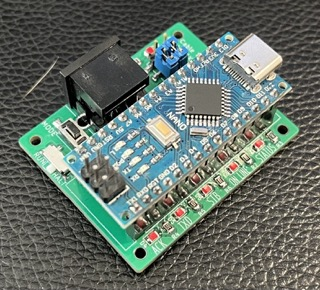
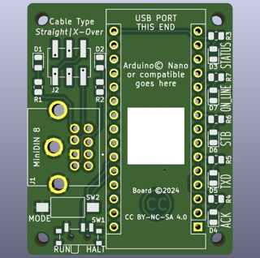

# Adapter Board for Panasonic Typewriter Interface

https://github.com/xunker/panasonic_typewriter_interface

Here is an adapter board to make it easier to wire up your typewriter. It's
based ardound the Arduino Nano, and will work with compatible clones like
LGT8F328.

### Voltage Warning

Some "Nano" clone modules might be 3.3V instead of 5V. This board will **only
work with 5V models**, and a **3.3V model will get fried** if you try use one
instead.

## Features

In addition to connecting your typewriter to the microcontroller, this board
also has some extra benefits:

### Cable Type Detection and Selection

When you connected to a KX-R typewriter, this board will tell you the kind of
cable you are using (straight or cross-over) and gives you a simple way to
configure the board for it.

When the connected typewriter is turned on, either LED D1 or D2 should turn on.
Move the two jumpers on J2 to the side closest to whatever LED is lit.

### Separate Signal LEDs

LED D3 is a duplicate of the built-in LED on the Arduino Nano, and is used
as a general-purpose "status" LED.

LEDs D4-D7 show the state of the signals to and from the typewriter. This can
help when troubleshooting connection problems.

### Raw Typewriter Signal Breakout

Connector J3, 6-pin JST GH, can use used to access the raw (unbuffered) signals
going to and from the typewriter.

### Arduino Serial Breakout

Conenctor J4, 6-pin JST GH, can use used to access the TTL-level Serial signals
from the Arduino Nano.

#### Second Serial Breakout ('328PB)

If your module is using the atMega328PB MCU (only used in clones), this board
also gives you access to the second serial device (`Serial1`).

### I2C Breakout

Conenctor J5, 4-pin JST SH, provides a connection for I2C and is compatible
with the "Stemma QT" connector standard used by AdaFruit and Sparkfun.

## Files

Files for this board can be found in
[panasonic_typewriter_interface](./panasonic_typewriter_interface).

## Bill of Materials

Qty | Name                       | ID     | Notes
----|----------------------------|--------|-----------------------------------
1   | Arduino Nano or compatible | A1     | If using a clone, ensure 5V model
7   | 0805 SMD LED               | D1-D7  | any LED of correct size will do
1   | 2x06 SMD Header, 2.54mm    | J2     |
2   | Jumpers/Shunts for J2      | n/a    |
1   | MiniDIN-8 connector        | J1     | KMDGX-8S-AS, but most others work
2   | 0805 1.2K ohm Resistor     | R1, R2 |
5   | 0805 220-330ohm Resistor   | R3-R7  |
1   | PCM12 Switch, SMD SPDT     | SW1    |
1   | FSMSM Button               | SW2    |
1   | 1206 Fuse, SMD, <500mA     | F1     | Optional
2   | JST GH Connector, 6-pin    | J3, J4 | Optional
1   | JST SH Connector, 4-pin    | J5     | Optional

