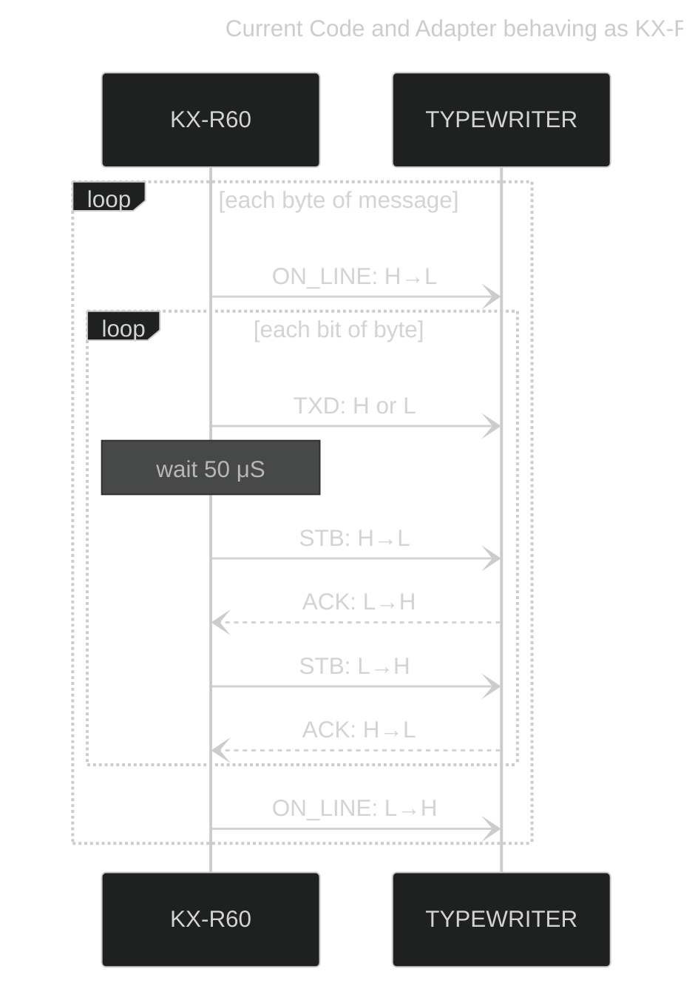
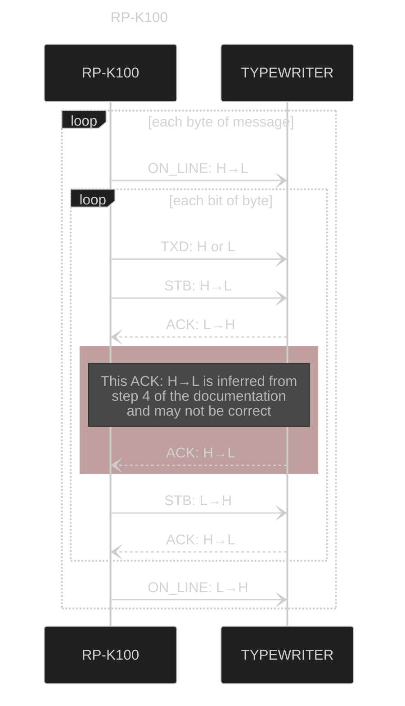
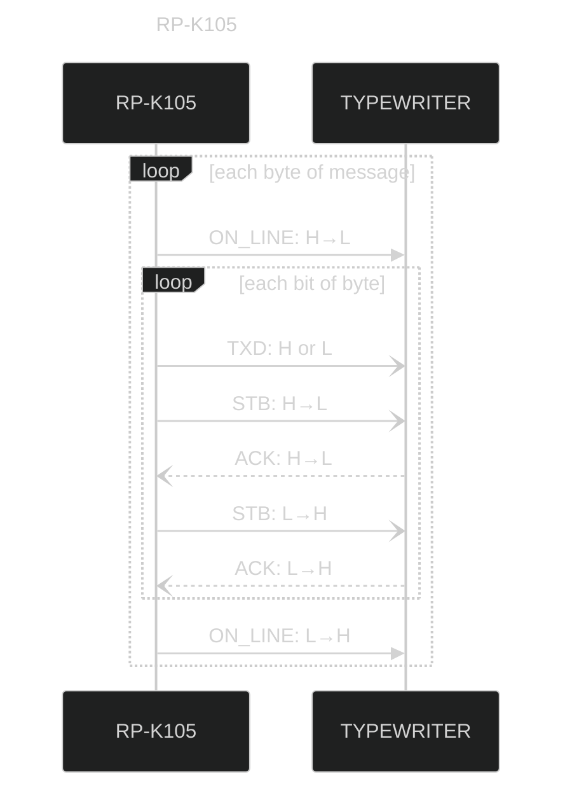

# RP-K10x vs KX-R60

I originally thought that the KX-R60 (for the KX-R series) worked in the same way as the RP-K100 and
RP-K105 adapters, albeit with a different plug (MiniDIN-8 vs DE-9).

Now that I've purchased a KX-T34 cupwheel to test with, I realize this is not the case and they
are different (logically AND electrically).

# KX-R60

This is the flow as __currently tested working__ with a KX-R typewriter.

All voltages are +5V DC.

# RP-K10x

In my testing with a KX-T34 typewriter (with DE-9 port), it appears the voltages _may not_ be +5V
DC.

I seems like the KX-T34 will respond incomming signals where 0v is LOW and 5v is HIGH. However,
the /ACK signal appears to swing from about 1.9v for LOW and 10v for HIGH.

This could make sense since these are older designs. The 10v /ACK signal may have been designed
to trigger a high-side switch for the signal, using an older P-Channel Mosfet. That means it might
need Vgs(th) to be > 7v to be "fully off", hence why it is pulls /ACK to 10v.

### Specific notes around KX-T34 test with status LEDs

Halts at "waiting ACK->HIGH". However, ACK goes from 1.89v to 3.25v. 3.25v may not be high enough
to trigger the Arduino input. TODO: try higher value resistor on LED?

After removing LED, now gets stuck at "waiting ACK->LOW". However, ACK voltage is setting at 6v!
TODO: maybe the INPUT_PULLUP resistance is too high for /ACK?

## RP-K100

From [KX-W50TH/KX-W60TH Service Manual](./panasonic_rp-k100_interface_circuit.pdf):

> Process;
>
> (1) The RP-K100 changes the ON LINE signal from H to L indicating that data transmission has
> started. This ON LINE signal remains Low during the transmission of 1 byte.
>
> (2) The RP-K100 first sends the LSB (D0) of a transmitted byte to the TXD line and changes the STB signal from H to .L This STB signal is sent to P51 of the CPU which is the interruption.
>
> (3) In the interruption state, the CPU receives a TXD signal and changes the ACK signal from L to H. This ACK signal is sent to the RP-K100.
>
> (4) After the RP-K100 has received the ACK signal (L level), the STB signal changes from L to H.
>
> (5) When the STB signal (High) is sent from the RP-K100, the thermalwriter sends the ACK signal (High) to the RP-K100.
>
> (6) When the ACK signal is High, the RP-K100 starts to send the next bit of data.
>
> (7) Once the RP-K100 sends 1byte of data (8 bits) ot the CPU, the ON LINE signal changes from L to H.

Differences from KX-R60:
* /ACK transitions are reversed, and may have extra transition
  * goes LOW after STB set LOW (vs going HIGH on RX-R60)
  * might have an additional HIGH to LOW transitions immediately after
    * Unsure, steps 3-5 are confusing and may be a typo
  * goes HIGH after STB set HIGH (vs going LOW on RX-R60)

## RP-K105

> Process;
>
> (1) The RP-K105 changes the ON LINE signal from H to L indicating that data transmission has started. This ON LINE signal remains Low during the transmission of 1 byte.
>
> (2) The RP-K105 first sends the LSB (D0) of a transmitted byte to the TXD line and changes the STB
> signal from H to L. this STB signal is sent to P51 of the CPU which is the interruption.
>
> (3) In the interruption state, the CPU receives a TXD signal and changes the ACK signal from H to L. This ACK signal is sent to the RP-K105.
>
> (4) After the RP-K105 has received the ACK signal (L level), the STB signal changes from L to H.
>
> (5) When the STB signal (High) is sent from the RP-K105, the Typewriter sends the ACK signal (High) to the
> RP-K105.
>
> (6) When the ACK signal is High, the RP-K105 starts to send the next bit of data.
> (7) Once the RP-K105 sends 1 byte of data (8 bits) to the CPU, the ON LINE signal changes from L
> to H.

Differences from KX-R60:
* /ACK transitions are reversed
  * goes LOW after STB set LOW (vs going HIGH on RX-R60)
  * goes HIGH after STB set HIGH (vs going LOW on RX-R60)

